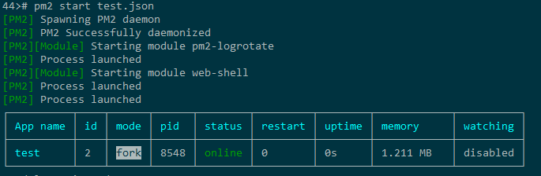

pm2 是一个带有负载均衡功能的Node应用的进程管理器.当你要把你的独立代码利用全部的服务器上的所有CPU,并保证进程永远都活着,0秒的重载, PM2是完美的,下面我们来看pm2常用的命令用法介绍吧。 

PM2 （github上的源码）是开源的基于Nodejs的进程管理器，包括守护进程，监控，日志的一整套完整的功能，基本是Nodejs应用程序不二的守护进程选择，事实上它并不仅仅可以启动Nodejs的程序，只要是一般的脚本的程序它同样可以胜任。

# 一、简介
#### PM2是node进程管理工具，可以利用它来简化很多node应用管理的繁琐任务，如性能监控、自动重启、负载均衡等，而且使用非常简单。
#### 下面就对PM2进行入门性的介绍，基本涵盖了PM2的常用的功能和配置。

# 二、安装

``` bash
​npm install -g pm2  # 全局安装，简直不能更简单。
```

# 三、入门教程
#### 挑我们最爱的express应用来举例。一般我们都是通过npm start启动应用，其实就是调用node ./bin/www。那么，换成pm2就是
#### 注意，这里用了--watch参数，意味着当你的express应用代码发生变化时，pm2会帮你重启服务，多贴心。
``` bash
pm2 start ./bin/www --watch
```
#### 入门太简单了，没什么好讲的。直接上官方文档：http://pm2.keymetrics.io/docs/usage/quick-start

# 常用命令
1.启动
### 参数说明：

#### --watch：监听应用目录的变化，一旦发生变化，自动重启。如果要精确监听、不见听的目录，最好通过配置文件。
#### -i --instances：启用多少个实例，可用于负载均衡。如果-i 0或者-i max，则根据当前机器核数确定实例数目。
#### --ignore-watch：排除监听的目录/文件，可以是特定的文件名，也可以是正则。比如--ignore-watch="test node_modules "some scripts""
#### -n --name：应用的名称。查看应用信息的时候可以用到。
#### -o --output <path>：标准输出日志文件的路径。
#### -e --error <path>：错误输出日志文件的路径。
#### --interpreter <interpreter>：the interpreter pm2 should use for executing app (bash, python...)。比如你用的coffee script来编写应用。

####完整命令行参数列表：地址
``` bash
pm2 start app.js --watch -i 2
```

2.重启
``` bash
pm2 restart app.js
```

3.停止
#### 停止特定的应用。可以先通过pm2 list获取应用的名字（--name指定的）或者进程id。
``` bash
pm2 stop app_name|app_id
```
#### 如果要停止所有应用，可以
``` bash
pm2 stop all
```

4.删除
#### 类似pm2 stop，如下
``` bash
pm2 stop app_name|app_id pm2 stop all
```

5.查看进程状态
``` bash
pm2 list
```

6.查看某个进程的信息
``` bash
pm2 describe 0 Describing process with id 0 - name oc-server
┌───────────────────┬──────────────────────────────────────────────────────────────┐
│ status            │ online                                                       │
│ name              │ oc-server                                                    │
│ id                │ 0                                                            │
│ path              │ /data/file/qiquan/over_the_counter/server/bin/www            │
│ args              │                                                              │
│ exec cwd          │ /data/file/qiquan/over_the_counter/server                    │
│ error log path    │ /data/file/qiquan/over_the_counter/server/logs/app-err-0.log │
│ out log path      │ /data/file/qiquan/over_the_counter/server/logs/app-out-0.log │
│ pid path          │ /root/.pm2/pids/oc-server-0.pid                              │
│ mode              │ fork_mode                                                    │
│ node v8 arguments │                                                              │
│ watch & reload    │                                                              │
│ interpreter       │ node                                                         │
│ restarts          │ 293                                                          │
│ unstable restarts │ 0                                                            │
│ uptime            │ 87m                                                          │
│ created at        │ 2016-08-26T08:13:43.705Z                                     │
└───────────────────┴──────────────────────────────────────────────────────────────┘
```

# 四、配置文件
1.简单说明
#### 配置文件里的设置项，跟命令行参数基本是一一对应的。
#### 可以选择yaml或者json文件，就看个人洗好了。
#### json格式的配置文件，pm2当作普通的js文件来处理，所以可以在里面添加注释或者编写代码，这对于动态调整配置很有好处。
#### 如果启动的时候指定了配置文件，那么命令行参数会被忽略。（个别参数除外，比如--env）
2.例子
``` bash
{
         "name" : "fis-receiver",                                    | 应用名称 
       "script" : "./bin/www",                                       | 实际启动脚本 
          "cwd" : "./",                                              | 当前工作路径 
         "watch": [                                                  | 监控变化的目录，一旦变化，自动重启 
         		"bin",                                               |
         		"routers"                                            |
         		],                                                   |
 "ignore_watch" : [                                                  | 从监控目录中排除 
                "node_modules",                                      |
                "logs",                                              |
                "public"                                             |
                ],                                                   |
 "watch_options": {                                                  |
                "followSymlinks": false                              |
                },                                                   |
   "error_file" : "./logs/app-err.log",                              | 错误日志路径 
     "out_file" : "./logs/app-out.log",                              | 普通日志路径 
           "env": {                                                  |
                "NODE_ENV": "production"                             | 环境参数，当前指定为生产环境 
                } 
}
```

# 五、自动重启
#### 前面已经提到了，这里贴命令行，更多点击这里。
``` bash
pm2 start app.js --watch
```
#### 这里是监控整个项目的文件，如果只想监听指定文件和目录，建议通过配置文件的watch、ignore_watch字段来设置。

# 六、环境切换
#### 在实际项目开发中，我们的应用经常需要在多个环境下部署，比如开发环境、测试环境、生产环境等。在不同环境下，有时候配置项会有差异，比如链接的数据库地址不同等。
#### 对于这种场景，pm2也是可以很好支持的。首先通过在配置文件中通过env_xx来声明不同环境的配置，然后在启动应用时，通过--env参数指定运行的环境。
1.环境配置声明
#### 首先，在配置文件中，通过env选项声明多个环境配置。简单说明下：
* env为默认的环境配置（生产环境），env_dev、env_test则分别是开发、测试环境。可以看到，不同环境下的NODE_ENV、REMOTE_ADDR字段的值是不同的。
* 在应用中，可以通过process.env.REMOTE_ADDR等来读取配置中生命的变量。
``` bash
        "env": { 
   "NODE_ENV": "production", 
"REMOTE_ADDR": "http://www.example.com/" 
             }, 
​    "env_dev": { 
   "NODE_ENV": "development", 
"REMOTE_ADDR": "http://wdev.example.com/" 
             }, 
​   "env_test": { 
   "NODE_ENV": "test", 
"REMOTE_ADDR": "http://wtest.example.com/" 
             }
```
2.启动指明环境
#### 假设通过下面启动脚本（开发环境），那么，此时process.env.REMOTE_ADDR的值就是相应的 http://wdev.example.com/ ，可以自己试验下。
``` bash
pm2 start app.js --env dev
```
# 七、负载均衡
#### 命令如下，表示开启三个进程。如果-i 0，则会根据机器当前核数自动开启尽可能多的进程。
``` bash
pm2 start app.js -i 3 # 开启三个进程 
​
​pm2 start app.js -i max # 根据机器CPU核数，开启对应数目的进程 
```

# 八、日志查看
#### 除了可以打开日志文件查看日志外，还可以通过pm2 logs来查看实时日志。这点对于线上问题排查非常重要。
#### 比如某个node服务突然异常重启了，那么可以通过pm2提供的日志工具来查看实时日志，看是不是脚本出错之类导致的异常重启。
``` bash
pm2 logs
```

# 九、指令tab补全
#### 运行pm2 --help，可以看到pm2支持的子命令还是蛮多的，这个时候，自动完成的功能就很重要了。
#### 运行如下命令。恭喜，已经能够通过tab自动补全了。
``` bash
pm2 completion install source ~/.bash_profile
```

# 十、开机自动启动
#### 可以通过pm2 startup来实现开机自启动。细节可参考。大致流程如下
1.通过pm2 save保存当前进程状态。
2.通过pm2 startup [platform]生成开机自启动的命令。（记得查看控制台输出）
3.将步骤2生成的命令，粘贴到控制台进行，搞定。

# 十一、传入node args
#### 直接上例子，分别是通过命令行和配置文件。
#### 命令行
``` bash
pm2 start app.js --node-args="--harmony"
```
#### 配置文件：
``` bash
{ 
  "name" : "oc-server", 
  "script" : "app.js", 
  "node_args" : "--harmony" 
}
```
1.实例说明
#### 假设是在centos下，那么运行如下命令，搞定。强烈建议运行完成之后，重启机器，看是否设置成功。
``` bash
pm2 save 
​pm2 startup centos 
​[PM2] Generating system init script in /etc/init.d/pm2-init.sh
[PM2] Making script booting at startup...
[PM2] /var/lock/subsys/pm2-init.sh lockfile has been added
[PM2] -centos- Using the command:
      su -c "chmod +x /etc/init.d/pm2-init.sh; chkconfig --add pm2-init.sh" 
​[PM2] Done.
[root@iZ94wb7tioqZ option_analysis]# pm2 save 
​[PM2] Dumping processes
```

# 十二、监控(monitor)
#### 运行如下命令，查看当前通过pm2运行的进程的状态。
``` bash
pm2 monit
```

# 十三、内存使用超过上限自动重启
#### 如果想要你的应用，在超过使用内存上限后自动重启，那么可以加上--max-memory-restart参数。（有对应的配置项）
``` bash
pm2 start big-array.js --max-memory-restart 20M
```

# 十四、更新pm2
``` bash
$ pm2 save # 记得保存进程状态 
​
​$ npm install pm2 -g 
​
​$ pm2 update
```

# 十五、pm2 + nginx
#### 无非就是在nginx上做个反向代理配置，直接贴配置。
``` bash
upstream my_nodejs_upstream 
{ 
  server 127.0.0.1:3001;
} 
server { 
  listen 80; 
  server_name my_nodejs_server; 
  root /home/www/project_root; location / 
   {
     proxy_set_header X-Forwarded-For $proxy_add_x_forwarded_for; 
     proxy_set_header Host $http_host; 
     proxy_set_header X-NginX-Proxy true; 
     proxy_http_version 1.1; 
     proxy_set_header Upgrade $http_upgrade; 
     proxy_set_header Connection "upgrade"; 
     proxy_max_temp_file_size 0; 
     proxy_pass http://my_nodejs_upstream/; 
     proxy_redirect off; proxy_read_timeout 240s;
   }
}
```
#### 官方文档：http://pm2.keymetrics.io/docs/tutorials/pm2-nginx-production-setup

# 十六、pm2编程接口
#### 如果想把pm2的进程监控，跟其他自动化流程整合起来，pm2的编程接口就很有用了。细节可参考官方文档：
#### http://pm2.keymetrics.io/docs/usage/pm2-api/

# 十七、模块扩展系统
#### pm2支持第三方扩展，比如常用的log rotate等


# 一、安装
#### Linux Binaries下载地址：https://nodejs.org/dist
``` bash
cd oneinstack/src
wget https://nodejs.org/dist/v4.2.4/node-v4.2.4-linux-x64.tar.gz
tar xzf node-v4.2.4-linux-x64.tar.gz
cp node-v4.2.4-linux-x64/bin/node /usr/local/bin/
cp -R node-v4.2.4-linux-x64/lib/node_modules /usr/local/lib/
ln -s /usr/local/lib/node_modules/npm/bin/npm-cli.js /usr/local/bin/npm
npm install pm2@latest -g #安装最新版本pm2模块
```
#### PS: 如果你的主机无法连接公网，先找到能连公网的主机安装上面的方法安装pm2，然后拷贝到你要安装的主机。拷贝如下目录：
``` bash
/usr/local/bin/node
/usr/local/lib/node_modules
```

# 二、PM2常用命令
#### 假设你现在已经写好了一个app.js的文件，需要启动，你可以使用pm2进行管理
1.启动
``` bash
# pm2 start app.js
# pm2 start app.js --name my-api   #my-api为PM2进程名称
# pm2 start app.js -i 0           #根据CPU核数启动进程个数
# pm2 start app.js --watch   #实时监控app.js的方式启动，当app.js文件有变动时，pm2会自动reload
```
2.查看进程
``` bash
# pm2 list
# pm2 show 0 或者 # pm2 info 0  #查看进程详细信息，0为PM2进程id
```
3.监控
``` bash
# pm2 monit
```
4.停止
``` bash
# pm2 stop all  #停止PM2列表中所有的进程
# pm2 stop 0    #停止PM2列表中进程为0的进程
```
5.重载
``` bash
# pm2 reload all    #重载PM2列表中所有的进程
# pm2 reload 0     #重载PM2列表中进程为0的进程
```
6.重启
``` bash
# pm2 restart all     #重启PM2列表中所有的进程
# pm2 restart 0      #重启PM2列表中进程为0的进程
```
7.删除PM2进程
``` bash
# pm2 delete 0     #删除PM2列表中进程为0的进程
# pm2 delete all   #删除PM2列表中所有的进程
```
8.日志操作
``` bash
# pm2 logs [--raw]   #Display all processes logs in streaming
# pm2 flush              #Empty all log file
# pm2 reloadLogs    #Reload all logs
```
9.升级PM2
``` bash
# npm install pm2@lastest -g   #安装最新的PM2版本
# pm2 updatePM2                    #升级pm2
```
10.更多命令参数请查看帮助
``` bash
# pm2 --help
```
# 三、PM2目录结构
#### 默认的目录是：当前用于的家目录下的.pm2目录（此目录可以自定义，请参考：五、自定义启动文件），详细信息如下：
``` bash
$HOME/.pm2                #will contain all PM2 related files
$HOME/.pm2/logs           #will contain all applications logs
$HOME/.pm2/pids           #will contain all applications pids
$HOME/.pm2/pm2.log        #PM2 logs
$HOME/.pm2/pm2.pid        #PM2 pid
$HOME/.pm2/rpc.sock       #Socket file for remote commands
$HOME/.pm2/pub.sock       #Socket file for publishable events
$HOME/.pm2/conf.js        #PM2 Configuration
```

# 四、自定义启动文件
#### 创建一个test.json的示例文件，格式如下：
``` bash
{
  "apps":
    {
      "name": "test",
      "cwd": "/data/wwwroot/nodejs",
      "script": "./test.sh",
      "exec_interpreter": "bash",
      "min_uptime": "60s",
      "max_restarts": 30,
      "exec_mode" : "cluster_mode",
      "error_file" : "./test-err.log",
      "out_file": "./test-out.log",
      "pid_file": "./test.pid"
      "watch": false
    }
}
```
#### 说明：

* apps：json结构，apps是一个数组，每一个数组成员就是对应一个pm2中运行的应用
 
* name：应用程序的名称

* cwd：应用程序所在的目录

* script：应用程序的脚本路径

* exec_interpreter：应用程序的脚本类型，这里使用的shell，默认是nodejs

* min_uptime：最小运行时间，这里设置的是60s即如果应用程序在60s内退出，pm2会认为程序异常退出，此时触发重启max_restarts设置数量

* max_restarts：设置应用程序异常退出重启的次数，默认15次（从0开始计数）

* exec_mode：应用程序启动模式，这里设置的是cluster_mode（集群），默认是fork

* error_file：自定义应用程序的错误日志文件

* out_file：自定义应用程序日志文件

* pid_file：自定义应用程序的pid文件

* watch：是否启用监控模式，默认是false。如果设置成true，当应用程序变动时，pm2会自动重载。这里也可以设置你要监控的文件。

# 五、实例
#### 已上面的test.json为例
``` bash
# cat > /data/wwwroot/nodejs/test.sh << EOF
#!/bin/bash
while :
do
    echo "Test" >> 1.log
    sleep 5
done
EOF
```
``` bash
# chmod +x test.sh      #添加执行权限
# pm2 start test.json    #启动，如下图：
```



